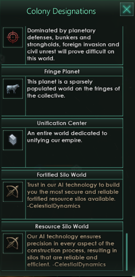
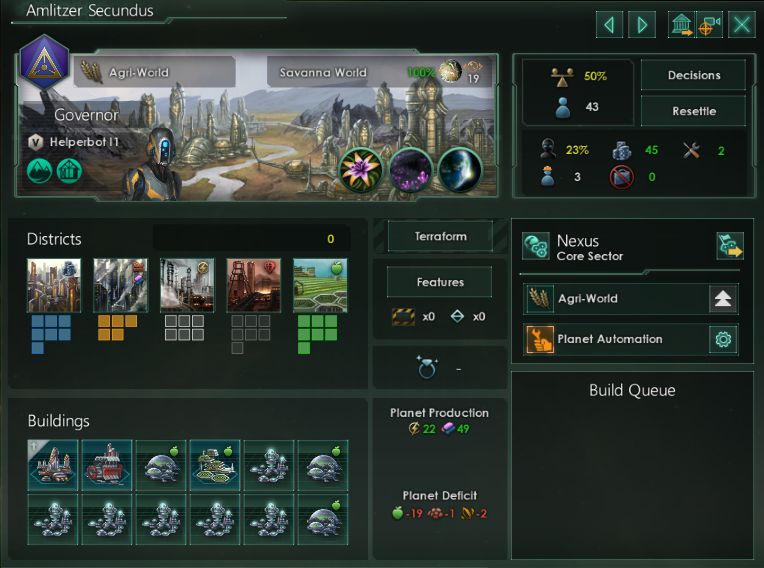
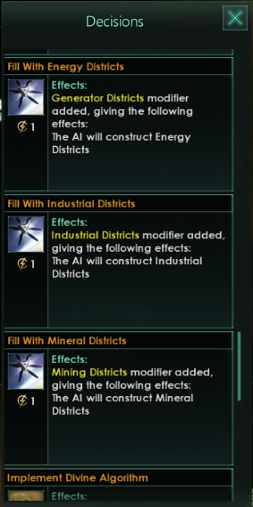
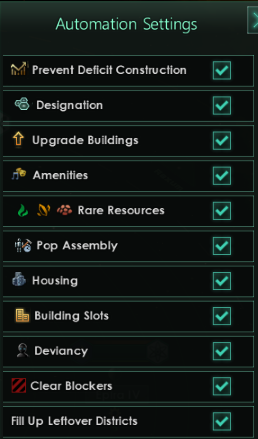

    

>Welcome to CelestialDynamics! Our name is synonymous with innovation, quality, and automation.
>
>We've been thriving in the automation industry for years now and are proud to be one of the most respected companies in the sector. Our focus is on providing the best automated solutions for interstellar exploration, resource management, and much more.
>
>At CelestialDynamics, we are passionate about helping you achieve your goals. Our dedicated team of engineers and scientists work tirelessly to provide the most advanced automation technologies in the galaxy. From AI-driven mining operations to cutting-edge research facilities, we have the expertise to bring your project to life.
>
>Our reputation speaks for itself. We are known for our exceptional customer service and attention to detail. We pride ourselves on providing turn-key solutions that are tailored to your specific needs. With us, you can trust that your project will be completed on time and on budget.
>
>Join us on the forefront of the automation revolution. Whether you're looking to expand your empire or explore the farthest reaches of the galaxy, CelestialDynamics is here to help. With our innovative technologies and dedicated team, you can be confident that you'll always stay ahead of the competition.

# Features
- Added more options for Planet Designations
- Added more options for Planet Automation
- Slightly modified some standard Planet Designations

## Planet Designations

    

### Fortified Silo World

The AI will build a *Planetary Shield Generator* and a mix of *Strongholds* and *Resource Silos* on this planet.

### Resource Silo World

The AI will build a *Planetary Shield Generator* and *Resource Silos* on this planet.

## Planet Automation

    

Vanilla AI doesn't usually build (due to a technical restriction) other districs except the one that fits the designation best. So for example on *Agri-Worlds* it's only able to build *Farming Districts*. With this option, it will build the district of your choice on *Agri-Worlds* once all *Farming Districs* have been built. Keep in mind that this feature will mostly start being relevant in the Mid-Game (after the year 2300).

### Planet Decisions

    

With these planet decisions you are able to influence which districts the AI will build on the planet once it has finished its planet designation.

### Planet Automation

    

With the option "Fill Up Leftover Districts" you can enable/disable the feature globally.

## Compatibility
Currently not compitable with other mods that overwrite the following files:
- 00_farming_automation.txt

While i aim to overwrite as few vanilla files as possible some modifications can't be done otherwise. Still, with some additional changes to this mod no overwrites should be needed anymore.

## Limitations
- The AI cannot remove any districts nor buildings.
- The AI can only construct one type of district at a time.
