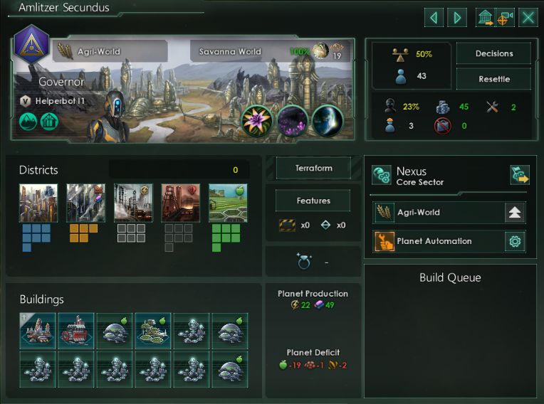

    

>Welcome to CelestialDynamics! Our name is synonymous with innovation, quality, and automation.
>
>We've been thriving in the automation industry for years now and are proud to be one of the most respected companies in the sector. Our focus is on providing the best automated solutions for interstellar exploration, resource management, and much more.
>
>At CelestialDynamics, we are passionate about helping you achieve your goals. Our dedicated team of engineers and scientists work tirelessly to provide the most advanced automation technologies in the galaxy. From AI-driven mining operations to cutting-edge research facilities, we have the expertise to bring your project to life.
>
>Our reputation speaks for itself. We are known for our exceptional customer service and attention to detail. We pride ourselves on providing turn-key solutions that are tailored to your specific needs. With us, you can trust that your project will be completed on time and on budget.
>
>Join us on the forefront of the automation revolution. Whether you're looking to expand your empire or explore the farthest reaches of the galaxy, CelestialDynamics is here to help. With our innovative technologies and dedicated team, you can be confident that you'll always stay ahead of the competition.

# Features
## Planet Designations
#### • Added more options for Planet Designations

## Planet Automation
#### • Added more options for Planet Automation
[Add picture with options]

#### • Force Industrial Districs on Agri-Worlds

    

Vanilla AI doesn't usually build (due to a technical restriction) other districs except the one that fits the designation best. So on *Agri-Worlds* it's only able to build *Farming Districts*. With this option it will build *Industrial Districts* (currently limited to *Industrial Districts*) on *Agri-Worlds* once all *Farming Districs* have been built. This can be useful for nations with the civic *Catalytic Processing*.
